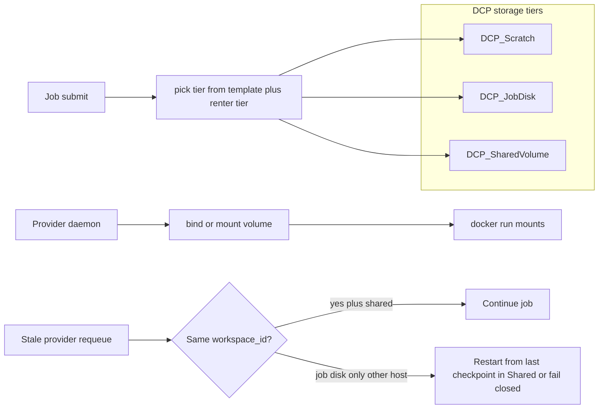
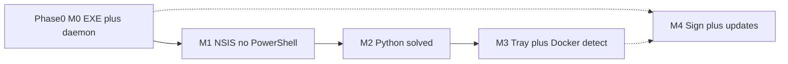
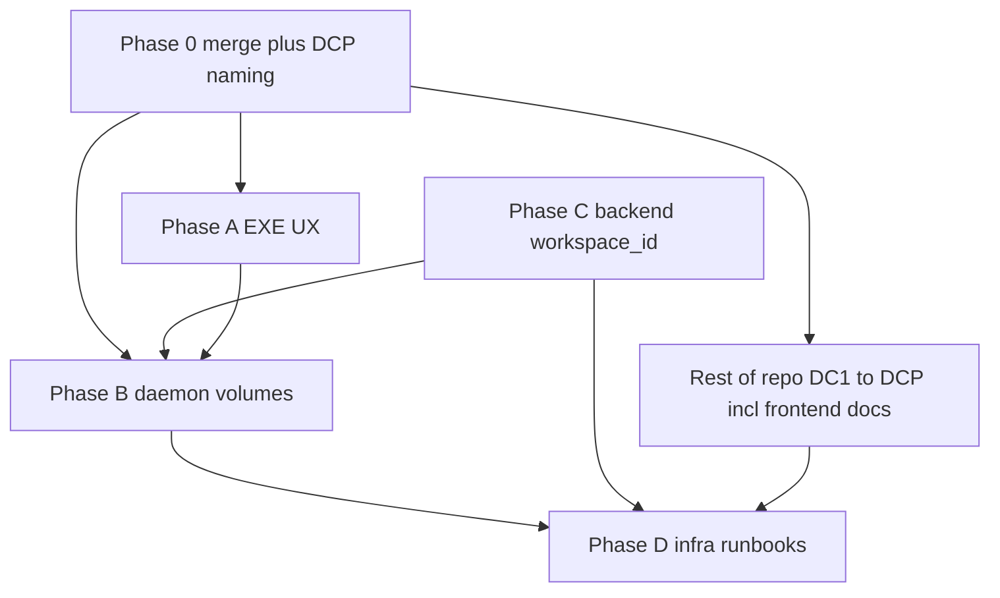

# DCP platform plan: EXE, daemons, backend, infrastructure, standardized volumes

## Context from the repo today

### Repository audit — install paths and “which daemon?” (verified)

**`install.sh` is not Linux-only.** [backend/public/install.sh](backend/public/install.sh) sets `DCP_OS` from `uname` (`Linux` / `Darwin`), downloads the daemon to **`${INSTALL_DIR}/dcp_daemon.py`**, and installs **systemd** (Linux) or a **LaunchAgent** (`setup_macos_launchagent`, plist at `~/Library/LaunchAgents/com.dcp.provider.plist`). So **macOS is already wired** at the installer level.

**What `install.sh` actually installs (answer: underscore daemon, not dash)**

- Local path **today:** **`DAEMON_PATH="${INSTALL_DIR}/dcp_daemon.py"`** with **`INSTALL_DIR` default `~/dcp-provider`** (mixed legacy: DCP dir name + `dc1_` daemon file—**Phase 0 fixes** to **`dcp_provider_daemon.py`** in the same folder).
- Download: **`GET ${API_BASE}/api/providers/download/daemon?key=...`** — the backend injects key/URL into the **first matching file** in `daemonCandidates`, which is **[`dcp_daemon.py`](backend/installers/dcp_daemon.py)** (underscore). So **`install.sh` never installs `dcp_daemon.py`** (dash).
- **Version string inside that file today:** `DAEMON_VERSION = "3.4.0"` (as shipped in repo; will change when unified).
- **`dcp_daemon.py` (dash, 3.5.0)** is **not** what `install.sh` gets unless someone manually copies it.

**Unified daemon (plan commitment):** After Phase 0 there is **exactly one** Python daemon source in the repo, **one** `DAEMON_VERSION` (e.g. bump to **3.6.0** or **4.0.0** after merge—pick one number at implementation time), **`GET /download/daemon`** serves only that file, and **`install.sh` + NSIS + unix/windows helpers** all reference the **same basename** (eventually renamed under **DCP naming** if you merge Phase 0 with the naming pass).

**What is broken or misleading today**

1. **Two different Python daemons**, different implementations:
   - [backend/installers/dcp_daemon.py](backend/installers/dcp_daemon.py) — `DAEMON_VERSION = "3.4.0"`, **`run_docker_job`** delegates to **`infra/docker/run-job.sh`** (fails if that script is missing on a provider machine).
   - [backend/installers/dcp_daemon.py](backend/installers/dcp_daemon.py) — `DAEMON_VERSION = "3.5.0"`, **inline `docker run`** with seccomp, pull phase, **`finally: shutil.rmtree(job_dir)`** (no durable workspace).

2. **Production always serves the first file on disk, not the newest:** [backend/src/routes/providers.js](backend/src/routes/providers.js) uses `daemonCandidates = [dcp_daemon.py, dcp_daemon.py]` and **`find` → first existing**. Both files exist, so **`dcp_daemon.py` is never served**. The higher version **3.5.0** in `dcp_daemon.py` is effectively **dead code** for `GET /api/providers/download/daemon`.

3. **Installer drift:** [backend/installers/dc1-setup-unix.sh](backend/installers/dc1-setup-unix.sh) downloads to **`dcp_daemon.py`** and systemd `ExecStart` points there — **wrong basename vs** `install.sh` and NSIS (which use **`dcp_daemon.py`**). [backend/installers/dc1-setup-windows.ps1](backend/installers/dc1-setup-windows.ps1) also targets **`dcp_daemon.py`** while [dc1-setup-helper.ps1](backend/installers/dc1-setup-helper.ps1) and [dc1-provider-Windows.nsi](backend/installers/dc1-provider-Windows.nsi) bundle **`dcp_daemon.py`**.

4. **Platform capability reality (not an installer bug):**
   - **Windows:** GPU Docker jobs need **Docker Desktop** + **WSL2 GPU** (or equivalent). The EXE can install the daemon, but **NVIDIA container workflows** are the same dependency stack as Linux.
   - **macOS:** **No NVIDIA CUDA in Docker** the same way as Linux; `check_docker()` in both daemons probes **`docker run --gpus all` + `nvidia/cuda`**. On Apple Silicon this will usually **fail**, so the daemon may **heartbeat** but **not** run CUDA container jobs unless you add a **separate product mode** (e.g. CPU-only, or **external vLLM endpoint** only — `install.sh` already has RunPod / `VLLM_ENDPOINT_URL` hints).

**Decision for the plan (recommended: merge, not “destroy both blindly”)**

- **Do not delete both and rewrite from scratch** without a merge pass — you would lose divergent fixes (e.g. inline docker hardening vs `run-job.sh` orchestration).
- **Canonical artifact (after Phase 0):** one file **`dcp_provider_daemon.py`**, one **`DAEMON_VERSION`**, **`install.sh` + API** serve only that name (see Phase 0 naming table).
- **Merge strategy:** use **`dcp_daemon.py` as merge base** only as a **git step**; **rename** the result to **`dcp_provider_daemon.py`** in the same PR. Port **3.5.0-only** behavior from `dcp_daemon.py`; resolve **`run-job.sh` vs inline docker** as one supported path.
- **Then:** archive **`dcp_daemon.py`** and remove **`dcp_daemon.py`** from installers; **`daemonCandidates`** = one path; align **unix/windows NSIS**, [README-BUILD.md](backend/installers/README-BUILD.md), and [install.sh](backend/public/install.sh) **`DAEMON_PATH`** to **`dcp_provider_daemon.py`** under **`~/dcp-provider`** / **`%LOCALAPPDATA%\dcp-provider`**.
- **Verify:** grep installers for `dcp_daemon`; integration test `GET /download/daemon` returns merged file; smoke **Linux + Windows + macOS** install docs with explicit **“GPU jobs supported / not supported”** matrix.

- **Windows EXE** (today): [backend/installers/dc1-provider-Windows.nsi](backend/installers/dc1-provider-Windows.nsi) builds `dc1-provider-setup-Windows.exe` and bundles **`dcp_daemon.py`**. **Phase 0:** rename installer output and bundled file to **DCP** names (`dcp-provider-setup-Windows.exe`, **`dcp_provider_daemon.py`**). Legacy **`dc1-setup-windows.ps1`** references **`dcp_daemon.py`**—align or deprecate.
- **Container jobs (pre-volume work):** the **inline** implementation in [backend/installers/dcp_daemon.py](backend/installers/dcp_daemon.py) uses `docker run` with `-v {job_dir}:/dc1/job:ro` and **`finally: shutil.rmtree(job_dir)`** — **no durable job workspace**. The **served** [backend/installers/dcp_daemon.py](backend/installers/dcp_daemon.py) path depends on **`infra/docker/run-job.sh`** — must be validated on real provider hosts.
- **Backend retry / failover**: Transient failures reset to `pending` in [backend/src/routes/jobs.js](backend/src/routes/jobs.js) (~2130+). Provider stale detection requeues `running|assigned|pulling` jobs in [backend/src/services/providerLivenessMonitor.js](backend/src/services/providerLivenessMonitor.js) by clearing `provider_id` and timestamps—**no attachment to a shared workspace URI**.

## RunPod-style storage (reference model to standardize)

RunPod (docs) effectively exposes three ideas:

| RunPod concept | Behavior (summary) | DCP standardized name (proposed) |
|----------------|-------------------|-----------------------------------|
| **Container disk** | Fast, tied to container/pod lifecycle; ephemeral feel | **`DCP_Scratch`** — tmpfs/container writable layers; **not** for resume |
| **Volume disk** | Persists for the pod’s life; often mounted as working dir | **`DCP_JobDisk`** — **host path or block volume** bound for **one job id** until terminal state |
| **Network volume** | Durable, attach at deploy; portable across instances | **`DCP_SharedVolume`** — **NFS / CSI / or object-store prefix** addressable from any worker in a region |

**Design rule:** Failover **within same host** can use `DCP_JobDisk` only. Failover **across hosts** requires `DCP_SharedVolume` (or flush checkpoints to object storage under a stable `workspace_id`).

---

## Phase 0 — Single cross-platform daemon + **DCP naming (do not skip)**

**Goal:** One served daemon, **one `DAEMON_VERSION`**, **DCP-aligned names** (no new `dc1_*` provider artifacts), consistent installers; **macOS and Windows** get the **same Python logic** as curl `install.sh` (subject to OS GPU limits above).

**Naming convention (apply in the same change set as the merge—not a follow-up “later”):**

| Item | Convention |
|------|------------|
| **Product** | **DCP** only in user-visible strings (installer pages, logs to user, tray, errors). |
| **Daemon file on disk** | **`dcp_provider_daemon.py`** (preferred) or **`dcp_daemon.py`** — pick one and use everywhere. |
| **Provider install dir** | **`~/dcp-provider`** (Linux/macOS), **`%LOCALAPPDATA%\dcp-provider`** (Windows). |
| **Env vars** | **`DCP_*`** only for new/changed vars; optional read of legacy `DC1_*` / `DCP_PROVIDER_KEY` aliases for one release. |
| **NSIS / scripts** | Rename **`dc1-provider-Windows.nsi` → `dcp-provider-Windows.nsi`**, **`dc1-setup-*.ps1` → `dcp-setup-*.ps1`** (or equivalent single pattern). |
| **Backend download** | [install.sh](backend/public/install.sh) `DAEMON_PATH` and [providers.js](backend/src/routes/providers.js) must serve the **new filename**; keep **`?key=`** contract unchanged. |
| **Internal code / comments** | Prefer **`dcp`** in new symbols; grep for `dc1` in touched files and fix provider-facing identifiers. **Next.js app** is a separate full pass — see **Frontend (Next.js) checklist** under *Naming migration* (same sprint / GitHub PRs). |

1. **Diff and merge** `dcp_daemon.py` → into **`dcp_daemon.py` as working copy**, then **rename** merged file to **`dcp_provider_daemon.py`** (update all references). Resolve **`run-job.sh` vs inline docker** as a single supported path.
2. **Backend:** [providers.js](backend/src/routes/providers.js) — **single** `daemonCandidates` entry pointing at **`dcp_provider_daemon.py`**; remove `dcp_daemon.py` and old underscore file from candidates after cutover.
3. **Public install:** [install.sh](backend/public/install.sh) — set **`DAEMON_PATH`** to the new filename under **`~/dcp-provider`**; migrate note for existing `~/dc1-provider` users (copy config or symlink doc).
4. **Fix** [dc1-setup-unix.sh](backend/installers/dc1-setup-unix.sh) (rename + paths + systemd unit **`ExecStart`** to new daemon path and **`dcp-provider`** dir if needed).
5. **Fix or retire** [dc1-setup-windows.ps1](backend/installers/dc1-setup-windows.ps1); align [dc1-setup-helper.ps1](backend/installers/dc1-setup-helper.ps1), [dc1-provider-Windows.nsi](backend/installers/dc1-provider-Windows.nsi), [daemon.ps1](backend/installers/daemon.ps1) to **DCP names + `%LOCALAPPDATA%\dcp-provider`**.
6. **Python daemon internals:** replace **`~/dc1-provider`** log paths and **`POWER_COST_CONFIG_FILE`** paths with **`~/dcp-provider`** (or `Path.home() / "dcp-provider"`); update docstring “DC1” → “DCP”.
7. **Documentation:** provider matrix — Linux (full CUDA Docker), Windows (Docker Desktop + WSL2 GPU), macOS (heartbeat / endpoint mode vs CUDA jobs).

**Exit criteria:** Fresh install on each OS runs **identical** `DAEMON_VERSION`; **no** `dcp_daemon.py` / `dcp_daemon.py` in active download or install paths; **provider-facing** strings and paths use **DCP** naming per table above.

---

## Naming migration — DC1 → DCP (cross-cutting)

**Policy:** User-facing and repo identifiers should say **DCP** (Decentralized Compute Platform), not DC1. **Provider daemon + installers:** naming is **mandatory in Phase 0** (see table above)—this section covers **remaining repo** (Docker tags, API aliases, templates, workflows).

**Scope (typical buckets)**

| Bucket | Examples today | Target |
|--------|----------------|--------|
| **Daemon / installer filenames** | `dcp_daemon.py`, `dcp_daemon.py`, `dc1-setup-*.ps1`, `dc1-provider-Windows.nsi` | `dcp_provider_daemon.py` (or `dcp_daemon.py`) and `dcp-setup-*.ps1`, `dcp-provider-Windows.nsi` — pick one pattern and apply consistently |
| **Install paths** | `~/dc1-provider`, `%LOCALAPPDATA%\dc1-provider`, LaunchAgent label already `com.dcp.provider` | Prefer **`~/dcp-provider`** / **`%LOCALAPPDATA%\dcp-provider`**; document one-time migration (copy config + re-download daemon) for existing providers |
| **Env vars / config keys** | `DC1_API_*`, `DCP_*` mixed in [install.sh](backend/public/install.sh) | Standardize on **`DCP_`** prefixes; support **deprecated aliases** for one release where cheap (`DC1_API_KEY` → same as `DCP_PROVIDER_KEY`) |
| **User-visible strings** | NSIS pages, tray, log lines (“DC1 Provider”) | **“DCP Provider”** / product name from single constant |
| **Docker / image names** | `dc1/llm-worker`, labels `dc1.*` | Align with published registry namespace (**`dcp/`** or existing `dcplatform/dcp-*` per [docker-images.yml](.github/workflows/docker-images.yml)); avoid breaking pulls without **tag migration + dual-tag period** |
| **HTTP API paths** | Next.js / clients may use `/api/dc1/...` rewrites | **Keep old routes as aliases** (301 or parallel mount) until clients updated; document deprecation |
| **Frontend (Next.js, repo root)** | [package.json](package.json) description “DC1 …”; `bg-dc1-*` / `text-dc1-*` via `dc1` key in [tailwind.config.ts](tailwind.config.ts); `const API = '/api/dc1'`; `__dc1_session` in [middleware.ts](middleware.ts); i18n under `messages/`; any “DC1” in `app/`, `components/` | **Product copy and code identifiers = DCP** — rename Tailwind theme **`dc1` → `dcp`** and **mechanically replace** utility classes (`dc1-void` → `dcp-void`, etc.). **Session cookie:** rename to e.g. `__dcp_session` **only with** a short migration note (existing sessions log out once). **Fetch base path:** prefer **`/api/dcp`** in app code **when** [next.config](next.config.mjs) (or middleware) exposes a parallel rewrite; otherwise keep calling `/api/dc1` internally while **UI strings** say DCP (path is not user-visible). |
| **User-facing documentation** | `docs/**/*.md`, root README, in-app `/docs` if present — “DC1” as product name | Replace **product** naming with **DCP**. **Exception:** literal server paths (`/home/node/dc1-platform`, PM2 name `dc1-provider-onboarding`) stay until infra rename is approved — use a **note** (“legacy path on VPS”) so ops runbooks stay copy-paste accurate. |

**Frontend + docs delivery:** Same **GitHub PR workflow** as the rest of the repo (feature branch → review → merge). No separate channel; bundle or stack PRs as the team prefers (one large naming PR vs frontend-only PR + backend PR), but **do not** leave the marketing UI saying DC1 while installers say DCP.

### Frontend (Next.js) checklist (implementation)

1. **Strings:** `messages/*`, metadata (`layout.tsx`, `openGraph`), error/toast copy — **DC1 → DCP** where it refers to the product.  
2. **Design system:** [tailwind.config.ts](tailwind.config.ts) `theme.extend.colors.dc1` → `dcp`; global search `dc1-` in `app/`, `components/`, `styles/`.  
3. **Middleware:** [middleware.ts](middleware.ts) — session cookie constant; any comments.  
4. **Config:** root [package.json](package.json) `name` / `description` (optional: keep npm `name` as `dc1-platform` until publish rename is decided — document if unchanged).  
5. **E2E:** [playwright](playwright.config.ts) tests that assert visible “DC1” text must be updated.  
6. **API rewrites:** if the app adds `/api/dcp/*`, mirror [next.config.js](next.config.js) rewrites to the same backend as `/api/dc1/*` until backend exposes a first-class `/api` prefix.

**Order of operations**

1. **Inventory:** `rg -i 'dc1|DC1'` in `app/`, `components/`, `messages/`, `backend/installers`, `backend/public`, `backend/src/routes`, `.github/workflows`, `docker-templates`, and **user-facing** `docs/` (skip or allowlist pure VPS filesystem paths if needed).  
2. **Non-breaking first:** strings, comments, docs, new filenames **with** redirects or dual download (`/download/daemon` serves new name, optional `Content-Disposition` filename).  
3. **Breaking second:** remove `dc1` paths only after telemetry shows low usage or major version bump; **cookie rename** and **Tailwind class rename** are **breaking for local UX** (one-time class swap + session reset) but not for API consumers.

**Exit criteria:** No new features ship with **DC1** in provider-facing names; **Next.js UI and user-facing docs** read **DCP** for the product; critical user journeys (install, dashboard copy, error messages) read **DCP**; technical debt list for remaining `dc1` in DB column names, PM2 process names, or historical URLs is tracked.

---

## Phase A — Windows EXE / installer (focus: Peter’s “double-click” path)

**Goal:** Provider onboarding matches consumer expectations: download, enter key, status visible—**minimize PowerShell visibility** without blocking advanced users.

**Concrete path to the dream:** Follow the milestone table in **Roadmap to the dream EXE** (M0→M4). Phase A bullets below are the **technical backlog** that maps onto those milestones; implement in that order unless M4 signing runs in parallel.

1. **Canonical daemon** — covered by **Phase 0** (Windows uses same **`dcp_provider_daemon.py`** as `install.sh` after naming pass).

2. **Enhance NSIS installer UX** (renamed **`dcp-provider-Windows.nsi`** in Phase 0; same content evolution)  
   - Optional **“Install Docker Desktop”** deep-link or detection banner (clear message if missing).  
   - Post-install **launch tray app** ([backend/installers/dcp_tray_windows.py](backend/installers/dcp_tray_windows.py) if wired) showing: connected / last heartbeat / GPU / **workspace root path**.  
   - Keep `/KEY=` prefill for enterprise rollouts.

3. **Bootstrap runtime**  
   - Document/support **embedded Python** vs “use system Python” (today helpers assume Python on PATH). For lowest friction, plan a **vendor Python** inside **`%LOCALAPPDATA%\dcp-provider`** (size tradeoff) or **winget** prerequisite step—choose one product stance.

4. **Code signing + SmartScreen**  
   - Plan EV cert pipeline for the EXE (reduces support burden); out-of-repo ops but blocks “real” launch.

**Exit criteria:** Non-developer can install, see “Connected”, and heartbeat reaches API without opening PowerShell.

---

## Roadmap to the dream EXE (Windows provider)

**North star (what “done” feels like):** A provider downloads **`dcp-provider-setup-Windows.exe`** from your site, **double-clicks**, enters an API key (or IT deploys with **`/KEY=`**), completes the wizard **without PowerShell**, and within about a minute sees **Connected** in the **system tray** (or a **plain-language** fix-it screen). The daemon **heartbeats** to the production API. **GPU Docker jobs** still depend on **Docker Desktop + WSL2 + NVIDIA** where applicable—the EXE **detects and explains** that stack; it does **not** pretend to install CUDA inside the guest. That honesty is part of the dream (trust over overselling).

**Dependencies:** **Phase 0** is **M0** (one daemon file, DCP names, consistent install dir). Everything below assumes M0 is merged or in flight on GitHub.

| Milestone | What ships | Acceptance (you can demo) | Typical owner |
|-----------|------------|---------------------------|---------------|
| **M0 — Trustworthy artifact** | Renamed NSIS → **`dcp-provider-Windows.nsi`**, output **`dcp-provider-setup-Windows.exe`**; bundles **`dcp_provider_daemon.py`** + helpers into **`%LOCALAPPDATA%\dcp-provider`**; documented build ([README-BUILD.md](backend/installers/README-BUILD.md)); optional CI job produces the EXE as an artifact. | Fresh VM: run EXE, files on disk, daemon can be started manually once Python exists; no conflicting second daemon filename. | Eng + Phase 0 PR |
| **M1 — No-PowerShell happy path** | NSIS flow: Welcome → API key (validate length/format; optional **online key check** against `/api/providers/me` or lightweight ping) → install location (advanced) → Finish; **`/KEY=`** (and **`/S`** if you support silent) for IT; shortcut “DCP Provider”; **Run** after install. Remove reliance on legacy **`dc1-setup-windows.ps1`** for defaults. | Non-dev completes install **only** via wizard; never sees blue PowerShell window for standard install. | Eng |
| **M2 — Python is not the user’s problem** | Pick **one** product stance and implement it: **(A)** NSIS prerequisite page + **winget** / Microsoft Store link + **detect** `python` on PATH before Finish, **or (B)** ship **embeddable Python** (or similar) under `%LOCALAPPDATA%\dcp-provider\runtime\` and launch daemon with that interpreter (size + legal notices in installer). Document uninstall (remove runtime folder). | Fresh Windows **without** Visual Studio / manual Python: after install + any one-click prereq, daemon process runs. | Eng |
| **M3 — Tray = control plane** | Wire **[backend/installers/dcp_tray_windows.py](backend/installers/dcp_tray_windows.py)** (or equivalent) to post-install: **auto-start** with Windows (scheduled task or Startup approved); UI shows **Connected / Degraded / Offline**, last heartbeat time, **GPU summary** if available; actions: **Open install folder**, **Open logs**, **Restart daemon**, **Copy support info**; **Docker Desktop** / WSL2 **detection** with short explanation + link if GPU jobs need it. | User glances at tray and knows if the machine is earning; never needs `taskkill`/`python` commands for routine ops. | Eng |
| **M4 — Trust + distribution** | **EV code signing** for the EXE (out-of-repo: cert, GitHub Actions or internal signing agent); **SmartScreen** mitigation doc for support; optional **“Update available”** in tray (compare `DAEMON_VERSION` or EXE version to backend or GitHub Releases). | Random user’s PC: double-click is not blocked as “unknown publisher”; release checklist includes sign + smoke on clean VM. | Eng + ops/founder |

**Suggested sequence (clear path):** **M0 → M1 → M2 → M3** in that order (each unlocks the next). **M4** can start **in parallel** once M0 produces a stable binary name (signing pipeline lags engineering).

**Out of scope for the “dream” (explicit):** Replacing Python with a **native C# daemon** (possible long-term); **silent install of Docker Desktop** without admin UAC (not realistic—stick to deep links and detection); **macOS/Linux EXE** (use existing `install.sh` / future `.pkg`—separate track).

**Metrics to prove the dream:** (1) % of new providers who complete install without support ticket in 24h; (2) time from download to first successful heartbeat on a clean Windows 11 VM; (3) tray “Connected” rate among installed machines.

---

## Phase B — Daemons (engine matrix + volume mounts + no destructive workspace)

**Goal:** Align the daemon with the meeting vision: **pick engine**, **mount the right tier**, **report capability**, **support resume** when backend requeues with same `workspace_id`.

1. **Capability report on heartbeat**  
   Extend heartbeat payload: CUDA/driver version, Docker present, **paths for `DCP_JobDisk` root**, optional **`DCP_SharedVolume` mountpoint**, GPU UUID/VRAM, last-known-good **(model_id → engine, image digest)** from local cache.

2. **Engine selection policy**  
   Implement as: daemon receives `execution_plan` JSON from job (or fetches manifest URL from backend): `{ engine: vllm|llama_cpp|ollama, image_ref, args, env }`. **Do not** hardcode only `dc1/llm-worker` without fallback when plan says llama.cpp.

3. **Docker `docker run` volume wiring** (unified daemon after Phase 0 — today split between `run-job.sh` and [dcp_daemon.py](backend/installers/dcp_daemon.py) inline `run_docker_job`)  
   - **`DCP_Scratch`**: keep tmpfs for `/tmp` (already).  
   - **`DCP_JobDisk`**: add **rw bind** e.g. `-v {job_workspace}:/opt/dcp/workspace:rw` plus read-only task mount. **Stop deleting** the workspace dir on failover path; only GC after job `completed|failed|cancelled` **and** backend ack.  
   - **`DCP_SharedVolume`**: mount provider-wide path (e.g. `/mnt/dcp-shared`) into container at agreed mountpoint for model cache + job checkpoints.

4. **Checkpoint contract**  
   Define **files the backend understands** (e.g. `workspace/manifest.json` with step id, tokenizer hash, partial outputs). Longer term: MoE / multi-step jobs write incremental state here.

5. **vLLM serve jobs**  
   [run_vllm_serve_job](backend/installers/dcp_daemon.py) should reuse **same volume policy** for `HF_HOME` / model cache to avoid re-download on restart.

**Exit criteria:** Kill a provider mid-job → job requeued → second provider **either** continues from shared workspace **or** fails with explicit “needs shared tier” error (no silent wrong results).

---

## Phase C — Backend (job model, dispatch, billing hooks)

**Goal:** First-class **workspace identity** and **storage tier** on the job; scheduler matches providers that can satisfy the tier; liveness/retry logic preserves semantics.

1. **Schema / fields** (SQLite migrations under [backend/src/db/migrations/](backend/src/db/migrations/) or existing pattern)  
   - `workspace_id` (uuid), `storage_tier` enum (`scratch|job_disk|shared`), `workspace_uri` (string: `file://`, `s3://`, `nfs://` prefix), `checkpoint_generation` (int).  
   - Optional: `execution_plan_ref` (url or json) and `engine`.

2. **Job submission API** ([backend/src/routes/jobs.js](backend/src/routes/jobs.js))  
   - Accept `storage` block: `{ tier, min_gb, retain_hours }`.  
   - Default: `scratch` for cheap batch; `shared` for **resumable** or `min_vram` + long `max_duration_seconds`.

3. **Dispatch / matching**  
   When assigning provider, require heartbeat fields: **tier support** + **free disk** + **mount present** for shared tier.

4. **Liveness + transient retry**  
   - [providerLivenessMonitor.js](backend/src/services/providerLivenessMonitor.js): on requeue, **increment `checkpoint_generation`**, append lifecycle event **with `workspace_id`**, do **not** clear workspace fields.  
   - [jobs.js](backend/src/routes/jobs.js) transient retry: same behavior—**preserve** workspace when `transient: true`.

5. **Billing** (already collecting `storage_gb_seconds` in result body)  
   Map tier to **price multipliers** (shared/network cheaper per GB-month amortized to job—define table in pricing service or static config).

**Exit criteria:** Integration test: simulate stale provider → job `pending` → second pickup with same `workspace_id`; daemon logs show continued checkpoint.

---

## Phase D — Infrastructure layer (standardize like RunPod, deploy anywhere)

**Goal:** One **documented** mapping so RunPod, bare metal KSA, and home Windows all speak the same **tier names**.

1. **RunPod template pack** (docs + example YAML/JSON, repo under `infra/runpod/` suggested)  
   - **Pod args**: container disk size = `DCP_Scratch` budget.  
   - **Volume disk** size = `DCP_JobDisk` backing for `/var/lib/dcp/jobs`.  
   - **Network volume** = mount at `/mnt/dcp-shared` for `DCP_SharedVolume` + HF cache.

2. **Object storage option** (portable “network volume” without NFS)  
   - Use **S3-compatible** (Cloudflare R2, MinIO, etc.) for checkpoints: daemon uses `workspace_id` prefix; **strong consistency** expectations documented (list-after-write).

3. **Control plane services**  
   - Small **workspace GC** worker: delete `job_disk` roots after TTL; lifecycle rules on bucket for shared prefixes.  
   - **Manifest CDN** for `execution_plan` / instant-tier digests (ties to existing [scripts/emit-instant-tier-manifest.mjs](scripts/emit-instant-tier-manifest.mjs)).

4. **Observability**  
   Metrics: pull time, bytes read/written per tier, checkpoint size, time-to-resume after requeue. (See **Safe rollout and measurements** below for platform-wide gates.)

**Exit criteria:** Runbook: “Spin RunPod worker with tier B+C” and “Bare metal Linux with NFS” using the **same** env vars: `DCP_TIER_SCRATCH_GB`, `DCP_JOB_DISK_ROOT`, `DCP_SHARED_MOUNT`.

---

## Safe rollout and measurements (single-day sprint; time is not a security gate)

**Principle:** **Security and compatibility** are enforced with **same-day reviews, tests, ACL design, and kill switches**—not with “wait a week.” Calendar duration does **not** substitute for those controls.

**Tradeoff (explicit):** A **one-day** cut compresses soak time; mitigate with **flags**, **instant rollback**, **scoped blast radius** (internal/RunPod providers first if you choose), and **accepting** that long-tail bugs may need a fast follow.

### 1. Snapshot before / after (same day, not 7-day baseline)

**Morning of the sprint:** export **point-in-time** numbers (SQLite query script, PM2 logs scrape, or dashboard screenshot) for:

| Signal | Why it matters |
|--------|----------------|
| **Job completion rate** (by `job_type`, `pricing_class`) | Catches daemon/docker regressions |
| **p50/p95 time in phase** (`pending` → `pulling` → `running` → `completed`) | Pull/scheduler issues |
| **Transient retry rate** and **exhausted retries** | New docker/volume paths |
| **Liveness requeue count** ([providerLivenessMonitor.js](backend/src/services/providerLivenessMonitor.js)) | Heartbeat / daemon loop |
| **Provider online count** and **heartbeat age** | Installer regressions |
| **Daemon version histogram** | Version skew after unified daemon |
| **5xx rate** on `/api/jobs/*`, `/api/providers/heartbeat`, `/download/daemon` | Backend / inject regressions |

**Evening same day (or after deploy):** re-run the **same queries** and diff. No requirement to collect a **historical week** before shipping—optional only if you want statistical noise reduction later.

### 2. Feature flags and kill switches (same day, no N-day canary)

- **Per-flag or env toggles** for: `execution_plan` dispatch, `storage_tier` non-default, **merged daemon** download.  
- **Same-day path:** enable for **internal test keys / RunPod** first in the morning; widen to all providers **same day** only after **checklist + smoke green**—not after “N days.”  
- **Kill switch:** one env to **revert** daemon artifact or disable new code paths; server keeps **forward-compatible** JSON (unknown fields ignored).

### 3. API and schema compatibility

- **New job columns:** nullable + defaults (`storage_tier` default `scratch`, `workspace_id` null) so **old daemons** keep working; backend must **not require** new fields on existing clients.  
- **Heartbeat payload:** additive JSON keys only; old daemons that omit `capabilities` still match providers.  
- **Deprecation:** if renaming download filename, keep **`Content-Disposition`** or **302** from old path for one release.

### 4. Daemon ↔ backend contract tests

- **Matrix in CI:** `MIN_DAEMON_VERSION` vs injected payload — assert server accepts **oldest supported** heartbeat shape.  
- **Contract test:** sample `POST /heartbeat` and `GET .../queue` fixtures for **vN and vN+1** daemon JSON.  
- **Integration tests** already partially exist ([backend/tests/integration/](backend/tests/integration/)) — extend for **requeue + workspace_id** when Phase C lands.

### 5. Synthetic / canary jobs (run repeatedly same day)

- **Manual or CI smoke** on **staging** (and prod if policy allows): minimal `llm_inference` or benchmark, completion under a **stated SLO**—run **before merge**, **after deploy**, and **once more** before end of day.  
- **RunPod canary provider:** if heartbeat drops or **3 consecutive** smokes fail, **hit kill switch**—no multi-day burn-in required.

### 6. Rollback triggers (compare to morning snapshot, not to a week)

**Hard stop** same day:

- Completion rate drops **more than agreed X%** vs **morning snapshot** (not vs 7-day history).  
- Transient retry spike **&gt; Y%** for **~30 minutes** post-deploy.  
- **Daemon download 5xx** or obvious corrupt inject (size/hash mismatch).  
- **Provider count** collapses vs morning snapshot after rollout.

### 7. Naming (DC1→DCP) safety

- **grep CI gate** (optional): fail PR if new `DC1` strings appear in `backend/installers`, `backend/public`, `app/`, `components/`, `messages/` (allowlist file for legacy API paths, VPS path literals in docs).  
- **User comms:** one changelog for providers (“folder rename optional migration”).

### 8. Load and soak (compressed for one-day scope)

- **Bounded stress (same day):** e.g. **30–120 minutes** of parallel short jobs on RunPod + one **burst** queue test—watch memory, FDs, SQLite `busy`.  
- **Optional 24h soak** is **not** a gate for security; schedule as **fast follow** if you want long-tail confidence.

**Same-day security checklist (not time-gated):** review **HMAC/inject** paths for daemon download; **ACLs** for shared volume prefixes; **no secrets** in client bundles; **seccomp/cap-drop** unchanged or improved vs legacy docker path.

**Exit criteria for “measurements in place” (single day):** morning **snapshot** + queries saved; **kill switch** documented; **≥2** successful smokes (pre/post deploy); **rollback runbook** one page; security checklist **signed off** same day.

---

## Phase E — Sequencing and dependencies

**Target:** **One-day sprint**—phases below are **logical order** for the same calendar day (pair/mob where possible), not multi-week milestones. **Trim scope** same day if slip risk (e.g. defer full RunPod template pack to day-end doc stub; ship Phase 0 + naming + flags + smokes first).

- **Phase 0 first** — unified daemon **and** provider-facing **DCP naming** (daemon filename, install dirs, NSIS/scripts); removes `dcp_daemon.py` and legacy underscore filename from the hot path.  
- **Naming (rest of repo)** — **Next.js + docs** (same GitHub PRs), Docker tags, templates, workflows: parallel or immediately after Phase 0 per inventory list.  
- **Parallel:** Phase A (installer / **dream EXE M1–M3**) and Phase C (schema/API) can start after Phase 0 **if** API shapes are agreed; **M4 signing** can overlap M2–M3.  
- **Daemon Phase B** should follow **workspace_id** contract from Phase C (or stub with feature flag).  
- **Same-day safety** (see **Safe rollout**): morning snapshot, kill switches, security checklist, repeated smokes—not calendar bake-in.

---

## Risks / explicit challenges

- **Security:** `shared` tier is a **multi-tenant risk**—must enforce **per-job prefixes**, optional **KMS** or signed URLs, never reuse paths across renters without ACLs. **Same-day code review + checklist** applies; **not** deferred behind a timeline.  
- **Single-day blast radius:** less calendar soak → rely on **flags, rollback, and scoped first deploy**; accept possible **fast-follow** hotfixes.  
- **Windows + Docker:** Docker Desktop friction remains; EXE cannot fully hide WSL2/Docker requirements—**message it clearly**.  
- **Cross-provider resume** without shared storage **is not safe** for arbitrary inference—default to **fail closed** or **restart job** with renter consent.

---

## Key files to touch (implementation phase)

| Area | Files |
|------|--------|
| Frontend / DCP naming | [tailwind.config.ts](tailwind.config.ts), [middleware.ts](middleware.ts), [next.config.js](next.config.js), `app/`, `components/`, `messages/`, [package.json](package.json), Playwright specs |
| EXE / dream path | [backend/installers/dc1-provider-Windows.nsi](backend/installers/dc1-provider-Windows.nsi) → `dcp-provider-Windows.nsi`, [backend/installers/dc1-setup-windows.ps1](backend/installers/dc1-setup-windows.ps1), [backend/installers/dcp_tray_windows.py](backend/installers/dcp_tray_windows.py), [backend/installers/README-BUILD.md](backend/installers/README-BUILD.md) — see **Roadmap to the dream EXE** |
| Daemon | [backend/installers/dcp_daemon.py](backend/installers/dcp_daemon.py) (docker run, GC), heartbeat upload routes in [backend/src/routes/providers.js](backend/src/routes/providers.js) |
| Backend | [backend/src/routes/jobs.js](backend/src/routes/jobs.js), [backend/src/services/providerLivenessMonitor.js](backend/src/services/providerLivenessMonitor.js), migrations, tests under [backend/tests/](backend/tests/) |
| Infra | new `infra/runpod/` + `docs/` runbook (only if you approve doc path in implementation) |
| Docs (product name) | User-facing `docs/**/*.md`, root README — **DCP**; allowlist literal VPS paths until infra rename |
